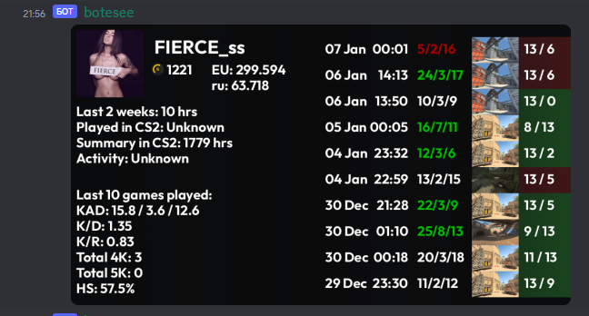
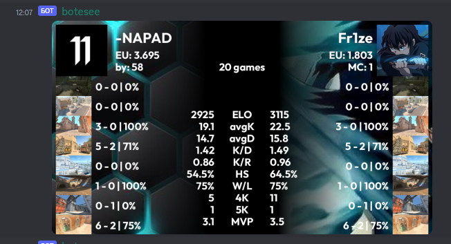
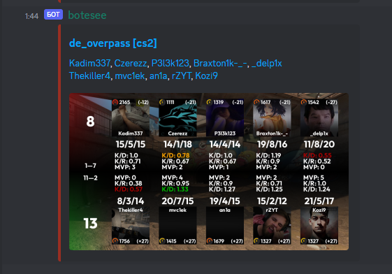

# botesee
A bunch of python services that provide some functions related to FaceIT platform and handle webhook requests from it to display statistics of matches.

### Supported commands:
- `/stats [player]` - shows stats of player for last 10 games
- `/compare [player1] [player2] [*[amount] games]` - compare 2 players based on last N games
- `/bet [match_id] [bet_type] [amount]` - take a bet in virtual points amount on a match

Examples:

### Webhooks
`botesee` handle webhooks from FaceIT and sends image of it in specific discord channel.
List of the subscribed users can be defined at https://developers.faceit.com/

#### Ongoing match example

#### End of the match example

### Miscellaneous
`botesee` provides support for a self-moderation based on the reactions of the message. If amount of `thumb down` emoji will exceed certain limit - message will be deleted by `botesee`

